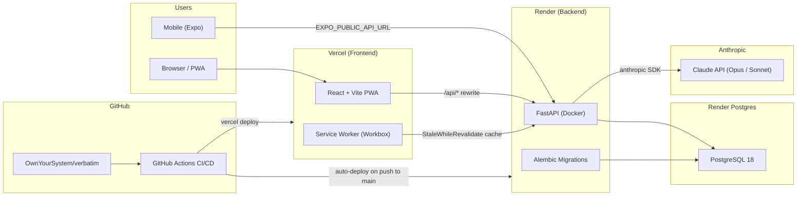

# Verbatim Architecture Diagram

```mermaid
flowchart LR
  subgraph Users["Users"]
    A["Browser / PWA"]
    B["Mobile (Expo)"]
  end

  subgraph Vercel["Vercel (Frontend)"]
    C["React + Vite PWA"]
    D["Service Worker (Workbox)"]
  end

  subgraph Render["Render (Backend)"]
    E["FastAPI (Docker)"]
    F["Alembic Migrations"]
  end

  subgraph DB["Render Postgres"]
    G["PostgreSQL 18"]
  end

  subgraph AI["Anthropic"]
    H["Claude API (Opus / Sonnet)"]
  end

  subgraph GitHub["GitHub"]
    I["OwnYourSystem/verbatim"]
    J["GitHub Actions CI/CD"]
  end

  A --> C
  B -->|"EXPO_PUBLIC_API_URL"| E
  C -->|"/api/* rewrite"| E
  D -->|"StaleWhileRevalidate cache"| E
  E --> G
  F --> G
  E -->|"anthropic SDK"| H
  I --> J
  J -->|"auto-deploy on push to main"| Render
  J -->|"vercel deploy"| Vercel
```
