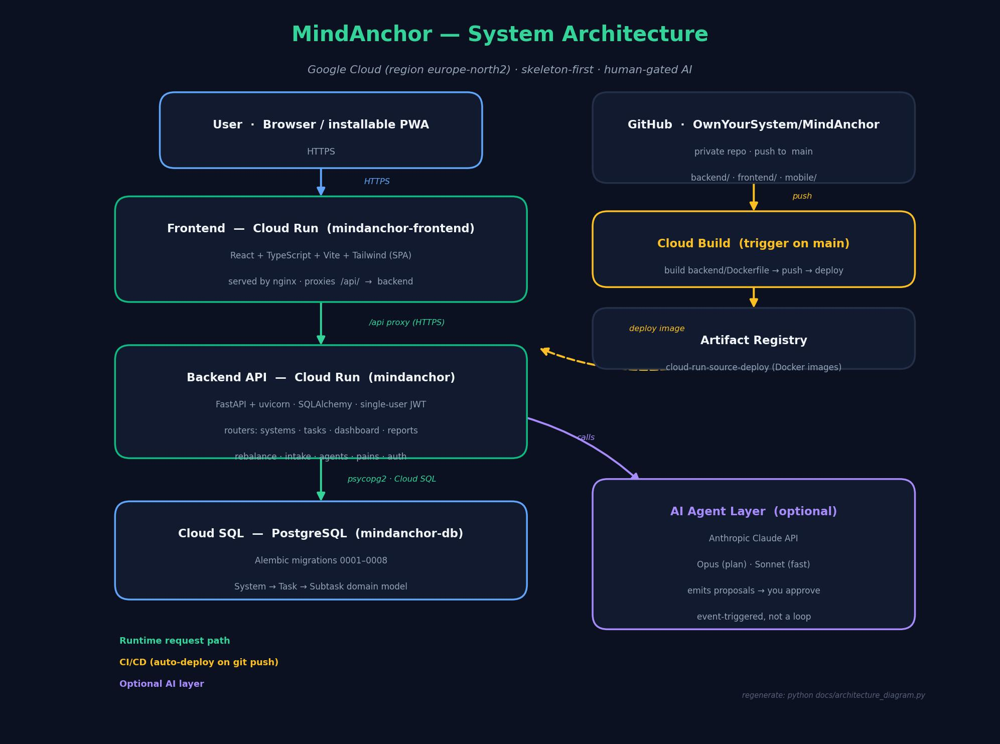

# Verbatim — Architecture & Philosophy



Verbatim is a single-user AI productivity system — an AI project manager,
scrum master, calendar, and morning briefing rolled into one. This document
explains *how* it is built and, more importantly, *why* it is shaped this way,
using the established principles of software architecture.

---

## The one-paragraph philosophy

**A working tool first, intelligence second.** Verbatim is a fully usable
manual productivity app that happens to have an AI layer bolted on top — never
an AI that you have to trust before the app does anything. Every architectural
decision flows from that single idea: the *core* must stand on its own, the
*AI* must be additive, and the *human* must always have the final say.

---

## Guiding architectural principles

### 1. Separation of concerns (layered architecture)
The system is split into clean horizontal layers, each with one job:

| Layer | Responsibility | Knows nothing about |
|---|---|---|
| **Client (PWA)** | Render UI, capture input | how data is stored |
| **API (FastAPI)** | Validate, route, enforce rules | how the UI looks |
| **Domain services** | Business logic (priority, focus) | HTTP or the database driver |
| **Persistence (ORM)** | Store & fetch | business rules |
| **AI agents** | Propose plans | being trusted blindly |

A change in one layer (e.g. swapping Postgres for another DB, or the PWA for a
native app) ripples no further than its neighbour. This is *low coupling, high
cohesion* in practice.

### 2. Dependency inversion — the AI is a plug-in, not a foundation
The backend defines an `LLMClient` protocol. At runtime it loads either a
**`StubLLM`** (deterministic, offline, free) or an **`AnthropicLLM`** (real
Claude) depending on whether an API key is present. The core depends on the
*abstraction*, never on Anthropic directly. Consequences:

- The whole app — and its entire test suite — runs with **zero API cost** and
  no network. Tests force an empty key and exercise the stub.
- Claude can fail, rate-limit, or be removed entirely and the productivity tool
  keeps working. The AI is a *strategy*, swapped behind an interface.

This is the **skeleton-first** decision (D2) expressed as code.

### 3. The human is part of the control loop (propose → approve)
The hardest product constraint: **the AI never reorganizes your work on its
own.** Agents emit a `RebalanceProposal` (a structured diff) with status
`pending`. Nothing changes until you approve it in the UI. Architecturally this
means:

- AI output is **data, not action** — it is persisted and reviewed, not executed.
- Every agent action is drawn from an **allow-list** of typed operations
  (`reorder`, `add_task`, `schedule`, …). Malformed or out-of-scope actions are
  dropped, not applied. This is *defense in depth* against an unpredictable
  component.

### 4. Event-triggered, bounded autonomy
Inspired by constraint-based agent designs, but deliberately **not** a
continuous loop. Agents fire only on discrete events (task edit, priority
change, check-in, weekly cycle), are **debounced** (one editing burst → one
proposal), and run under a **cost ceiling**. Predictable behaviour and bounded
spend matter more than maximal autonomy for a personal tool.

### 5. A single source of truth, versioned
The three-level domain model — **System → Task → Subtask** — is the spine of the
whole app. Schema evolution is managed with **Alembic migrations** (0001 →
0009), applied automatically on backend startup, so the database shape is
reproducible and the production DB is never hand-edited. *Priority inheritance*
(a subtask's effective priority derives from its System) keeps the model
normalized: priority lives in one place and cascades. Specific Knowledge is
linked to work items through normalized join tables (a real many-to-many ER),
not a denormalized id-list.

### 6. Stateless API, externalized configuration
The FastAPI service holds no session state — auth is a **stateless JWT**, so the
service scales and restarts freely (it runs scale-to-zero on **Cloud Run**). All
secrets and environment-specific values (`DATABASE_URL`, `JWT_SECRET`,
`PASSWORD_HASH`, `ANTHROPIC_API_KEY`) live **outside the code** as Cloud Run
environment variables, following the twelve-factor *config* principle. Nothing
sensitive is ever committed.

---

## How a request flows

**Reading your day (no AI):**
```
PWA → GET /api/dashboard/today → FastAPI → domain service builds the
rule-based daily focus (priority + status + deadline) → ORM reads Postgres →
JSON back to the PWA.
```
Purely deterministic. This works whether or not Claude is configured.

**Rebalancing (AI, human-gated):**
```
1. You change a System priority / add a task
2. API persists it and emits a domain event
3. Debounce collects rapid edits
4. Orchestrator routes to the affected specialist agent
5. Agent reads state + its role file + your immutable priorities
6. Agent returns a proposed diff (validated against the allow-list)
7. Stored as a RebalanceProposal (pending)
8. UI shows the diff → you approve or reject
9. Approve → changes applied, dashboard & calendar update
```

---

## Deployment topology

Live on **Google Cloud** (project `<VERBATIM_GCP_PROJECT_ID>`, region `europe-north2`).
See [`DEPLOY.md`](DEPLOY.md) for the full runbook.

- **Frontend** → React/Vite SPA built to static assets, served by **nginx on
  Cloud Run** (`verbatim-frontend`). nginx proxies `/api/*` to the backend
  server-side, so the browser only talks to one origin.
- **Backend** → **FastAPI in Docker on Cloud Run** (`verbatim`), auto-deployed
  from GitHub `main` via a **Cloud Build** trigger (build → Artifact Registry → deploy).
- **Database** → **Cloud SQL PostgreSQL** (`verbatim-db`); Alembic migrations
  applied automatically on backend startup.
- **AI** → **Anthropic Claude**, called only on user events.

GitHub is the hub: code flows *in* via commits, and *out* to Cloud Run via Cloud
Build auto-deploy. Note: the Cloud Build trigger deploys the **backend** only;
the **frontend is deployed manually** (see [`DEPLOY.md`](DEPLOY.md)).

---

## Why this matters (the trade-offs we chose)

| We optimized for | We accepted |
|---|---|
| The tool always works, AI optional | More plumbing (the stub/abstraction) |
| Human stays in control | AI can't act instantly on its own |
| Bounded, predictable AI cost | Not maximally "autonomous" |
| Simple single-user model | No teams/sharing in v1 |
| Cheap, scale-to-zero hosting (Cloud Run) | Cold-start latency after idle |

Every one of these trades flashiness for **trust, predictability, and
resilience** — the right priorities for a system whose entire job is to be the
dependable anchor for your attention.

---

*Generated diagram: regenerate with `python docs/architecture_diagram.py`.*
*See also [`ARCHITECTURE.md`](ARCHITECTURE.md) for the ADR-style decision log.*
